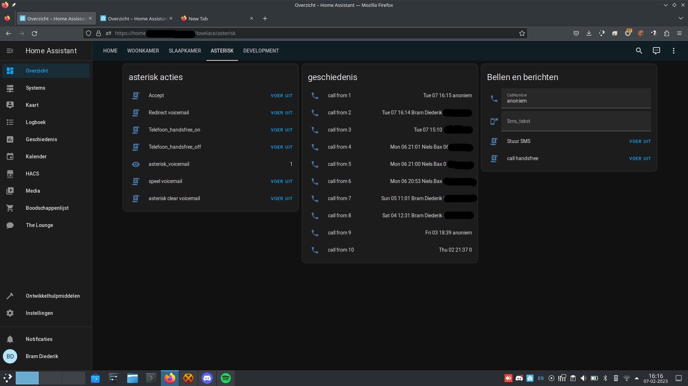

# asterisk-homeassistant-tools
asterisk number recognition, smart vociemail

This is an 22st solution for an awnsering machine using asterisk and home assistant.

Sascha picks up the call when your busy due to a schedule meeting or a manual switch or its late and gives the caller the option to
1 call voicemail.
2 continue to call. (behind password for not close persons)
3 give more info. (behind password for not close persons)


here is an (old) need to update youtube video https://www.youtube.com/watch?v=erOs4H4BXOA




this uses custom voice commands for asterisk. I use the google text to speech for this. I'm not sure i can share the .gsm files. 

here is a command to generate .gsm files using  gtts-cli (install with pip) and sox
```
 gtts-cli 'Dear caller this is a message' | sox -t mp3 -  -r 8000 -c1 message.gsm
```
